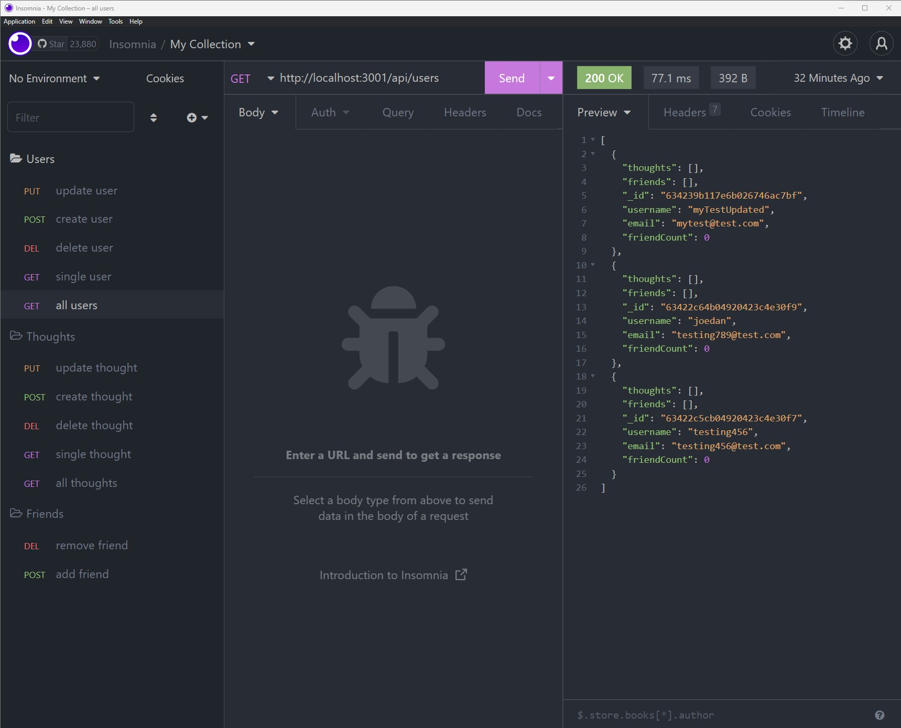

# Social Tree API - Module 18 Challenge

This is a MongoDB challenge to build an API for a social network.

## Mock Up



This is my completed code for the Module 18 challenge this week. We were given a task this week to build an API for a social network web application where users can share their thoughts, react to friends’ thoughts, and create a friend list.

## User Story

```
AS A social media startup
I WANT an API for my social network that uses a NoSQL database
SO THAT my website can handle large amounts of unstructured data
```

The Acceptance Criteria is as follows:

## Acceptance Criteria

```
GIVEN a social network API
WHEN I enter the command to invoke the application
THEN my server is started and the Mongoose models are synced to the MongoDB database
WHEN I open API GET routes in Insomnia for users and thoughts
THEN the data for each of these routes is displayed in a formatted JSON
WHEN I test API POST, PUT, and DELETE routes in Insomnia
THEN I am able to successfully create, update, and delete users and thoughts in my database
WHEN I test API POST and DELETE routes in Insomnia
THEN I am able to successfully create and delete reactions to thoughts and add and remove friends to a user’s friend list
```

This application utilizes MongoDB, Mongoose, Express.js, and Node.js. To run the app on localhost, just enter `node server.js` after entering `npm i`.

## Please see attached links to Repository and Walkthrough Video:

### https://github.com/jdanleano/Social-Tree-API

### https://youtu.be/fI02PECvkVo
